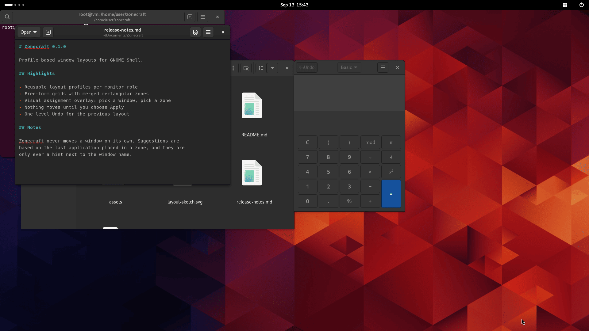
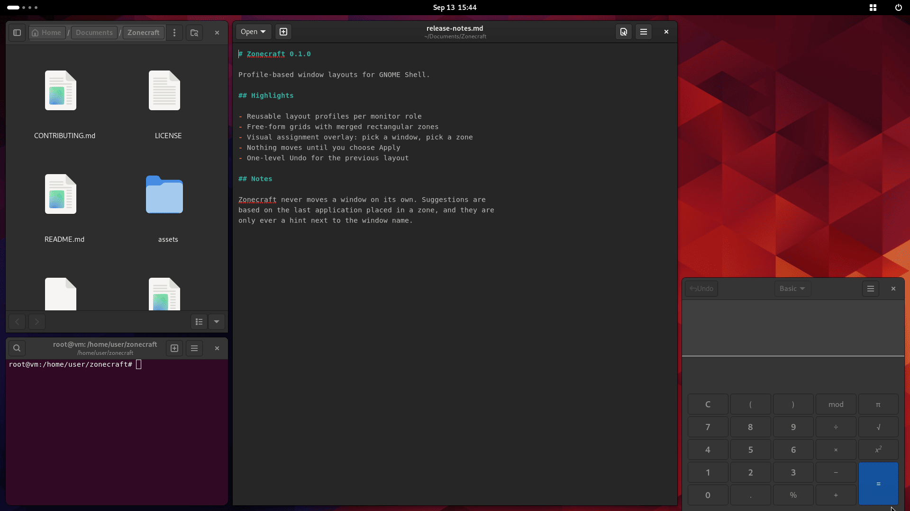
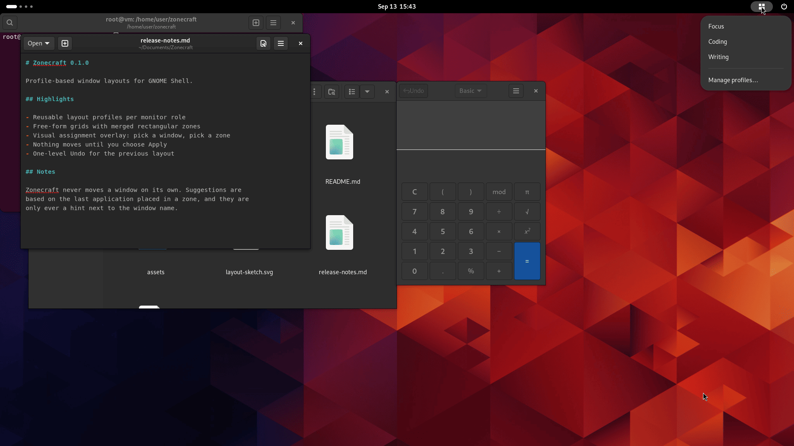
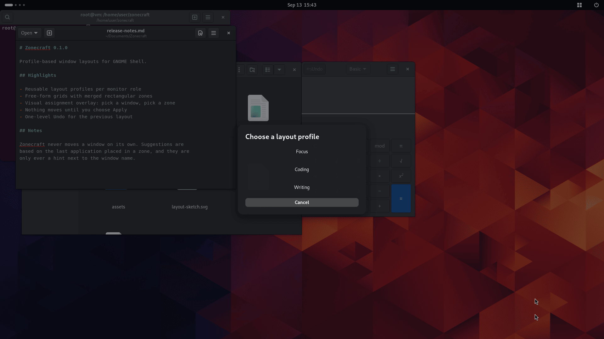
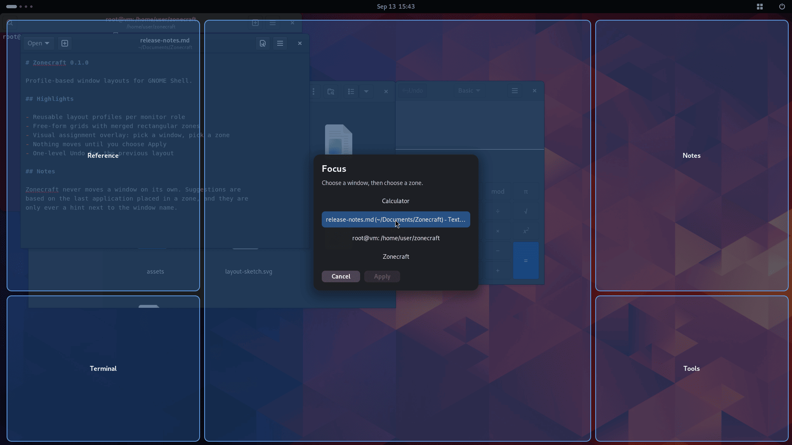
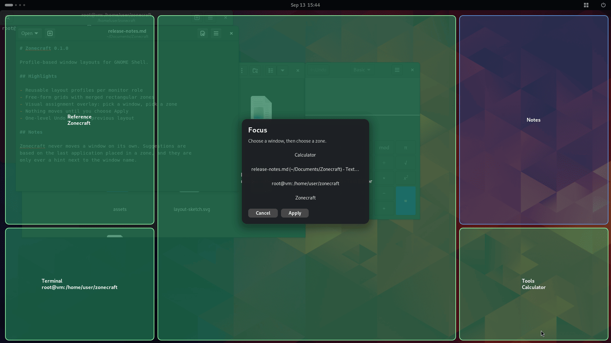
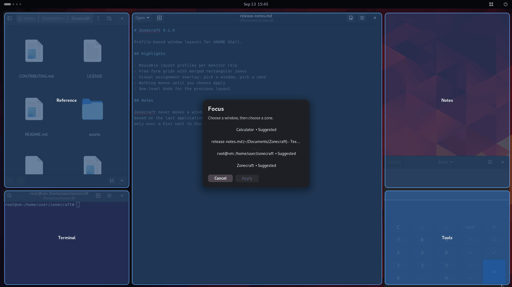
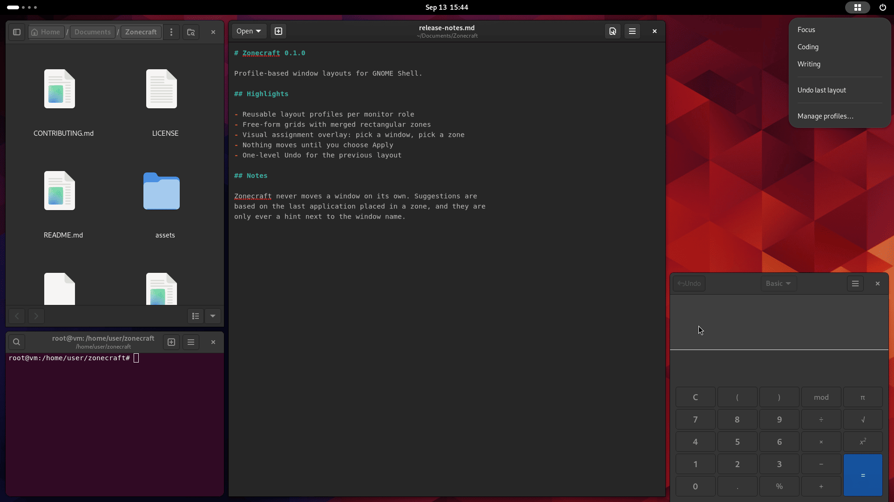

# Zonecraft

Zonecraft is a profile-based window organizer for GNOME Shell. Design a grid for each monitor role, start a profile, assign an open window to each zone, and apply the layout only when you are ready.

> [!IMPORTANT]
> Zonecraft is in early development. Version `0.1.0` targets Fedora and is installed from source. Publishing on extensions.gnome.org is not a goal right now — see [Roadmap](#roadmap).

## Demo

A cluttered workspace, and the same four windows after one pass through Zonecraft.

| Before                                                                                | After                                                                               |
| ------------------------------------------------------------------------------------- | ----------------------------------------------------------------------------------- |
|  |  |

### The workflow

Start a profile from the panel indicator, or press <kbd>Super</kbd>+<kbd>Shift</kbd>+<kbd>Z</kbd>.

| Panel indicator                                                                                             | Profile chooser                                                      |
| ----------------------------------------------------------------------------------------------------------- | -------------------------------------------------------------------- |
|  |  |

The assignment overlay draws the grid over your monitor and lists the windows on the current workspace. Choose a window, then choose a zone. Nothing moves yet.

| Zones and windows                                                                                  | Four windows assigned                                                                           |
| -------------------------------------------------------------------------------------------------- | ----------------------------------------------------------------------------------------------- |
|  |  |

Select **Apply** and only the zones you filled are used; the empty `Notes` zone above is left exactly as it was. Zonecraft remembers which application you placed in each zone and offers it next time as a suggestion, and the previous positions stay available under **Undo last layout**.

| Suggestions                                                                     | One-level undo                                                               |
| ------------------------------------------------------------------------------- | ---------------------------------------------------------------------------- |
|  |  |

> [!NOTE]
> These are captures of a real GNOME Shell session running the extension. See [docs/screenshots/README.md](docs/screenshots/README.md) for how they were recorded, and for the one screen that is still missing.

## Features

- Multiple reusable layout profiles.
- Free-form layouts: split any zone side by side or top and bottom, as often as needed (up to 64 zones per monitor), and resize each divider independently.
- Different layouts for the primary monitor and monitors to its left, right, above, or below.
- Visual assignment overlay with one window per zone.
- Suggestions based on the last application used in a zone—never automatic movement.
- Partial application, safe cancellation, and one-level Undo.
- Keyboard access through <kbd>Super</kbd>+<kbd>Shift</kbd>+<kbd>Z</kbd> and a GNOME panel indicator.
- Local-only settings with no accounts, network requests, or telemetry.

## Compatibility

| Fedora | GNOME Shell | Session | Status           |
| ------ | ----------- | ------- | ---------------- |
| 44     | 50          | Wayland | Primary target   |
| 43     | 49          | Wayland | Supported target |

Zonecraft is a GNOME Shell extension, not a standalone compositor. It does not support KDE Plasma, Sway, Hyprland, or other desktop environments. X11 is not a supported target.

## Install from source on Fedora

Install the development tools:

```bash
sudo dnf install gnome-shell gjs libadwaita nodejs npm make zip
```

Build and install the extension for the current user:

```bash
npm ci
make install
```

Log out and back in, then enable Zonecraft:

```bash
gnome-extensions enable zonecraft@jmonjardino.dev
```

Open its profile editor with the panel menu or:

```bash
gnome-extensions prefs zonecraft@jmonjardino.dev
```

## Use

1. Open **Manage profiles…** from the Zonecraft panel indicator.
2. Create a profile and design the layout for each monitor role: select a zone in the preview, split or remove it, and drag the gaps between zones to resize them. Profiles saved by `0.1.0` are converted automatically.
3. Start the profile from the panel, with its **Apply** button in preferences, or press <kbd>Super</kbd>+<kbd>Shift</kbd>+<kbd>Z</kbd>. To change the shortcut, select **Open selector** in preferences and press the new combination.
4. Choose a window and then a zone. Repeat as needed.
5. Select **Apply**. Empty zones and unselected windows are left untouched.
6. Use **Undo last layout** from the panel if you want to restore the previous positions.

Only normal windows from the current workspace are offered. Minimized windows are included and restored when assigned. Dialogs, fullscreen windows, Shell surfaces, and windows that reject movement or resizing are excluded.

### Monitor roles

Profiles bind to the primary monitor and to relative roles such as `left-1` or `right-2`. Secondary displays are ranked by distance from the primary display. If a required role is absent, Zonecraft warns you and applies only the layouts that have a matching monitor; it never silently substitutes another display.

## Development

```bash
npm ci
npm test
npm run check
npm run build
make pack
```

The release archive is written to `build/releases/zonecraft@jmonjardino.dev.shell-extension.zip`. Runtime code is TypeScript compiled to ES2023 modules for GJS. The Shell interface uses St/Clutter; preferences use GTK4/libadwaita; GSettings stores a versioned JSON document.

For an isolated Shell smoke test on Fedora 44:

```bash
npm run test:shell
```

For runtime logs:

```bash
journalctl --user -f -o cat /usr/bin/gnome-shell
```

You can also open Looking Glass with <kbd>Alt</kbd>+<kbd>F2</kbd>, enter `lg`, and inspect the **Extensions** and **Errors** tabs.

## Data and privacy

Zonecraft stores profiles in the local GSettings key `org.gnome.shell.extensions.zonecraft`. Application hints contain only a sandboxed application ID, GTK application ID, or WM class. Window titles are never persisted. Zonecraft performs no network access and has no telemetry.

## Current limitations

- Assignments require confirmation every time a profile is started.
- Only the active workspace is considered.
- Each zone accepts one window.
- There are no automatic application rules, profile import/export, or translations in `0.1.0`.
- Some applications enforce minimum sizes and may not fit very small zones exactly.

## Roadmap

Potential future work includes profile import/export, community translations, optional application rules, and support for later GNOME Shell releases. Compatibility is declared only after testing on each GNOME version.

Publishing on extensions.gnome.org is deliberately out of scope. Zonecraft was written with AI assistance for personal use, as the headers of `src/extension.ts` and `src/prefs.ts` state, and the EGO review process expects a maintainer who can answer for every line under review. Install from source, and fork it freely if you want to take it further. Issues and pull requests are still welcome here.

## Contributing and security

Contributions are welcome. Read [CONTRIBUTING.md](CONTRIBUTING.md) before opening a pull request and follow the [Code of Conduct](CODE_OF_CONDUCT.md). Please report security issues using the private process in [SECURITY.md](SECURITY.md), not a public issue.

## License

Zonecraft is free software licensed under the [GNU General Public License v3.0 or later](LICENSE).
